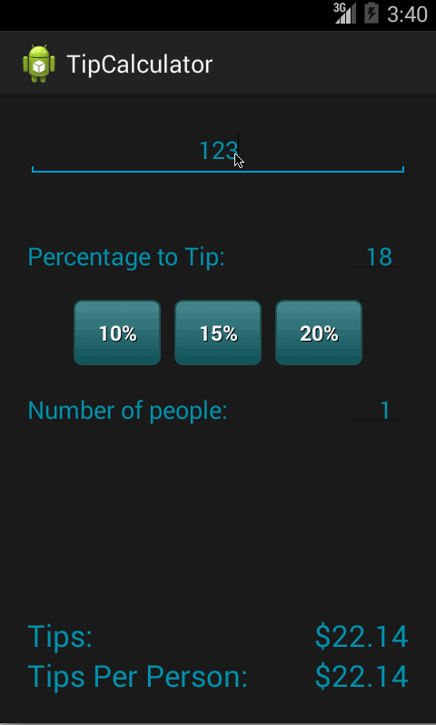

Android_Bootcamp_TipCalculator
==============================

Android Bootcamp Assignment 2

This is an Android demo application for calculating tips. User can set total amount, tip percentage and how many people to split the tips.
App will automatically save the last tips percetage and load as default during next launch

Time spent: 5 hours spent in total

Completed user stories:

 * [x] User is displayed the tip of specified percentage for specified entered amount
 * [x] User enters the total amount of the transaction
 * [x] User can select between tip amounts (i.e 10%, 15%, 20%)
 * [x] Upon selecting tip amount, formatted tip value is displayed
 * [x] (Optional) User changes the total amount and updated tip is reflected automatically
 * [x] (Optional) User can select custom tip percentage if desired
 * [x] (Optional) User can select how many ways to split the tip
 * [x] (Optional) User can edit preset tip percentages and have them persist across launches
 * [x] (Optional) Experiment with trying input widgets to replace the buttons and/or textviews
 * [x] (Optional) Improve the user interface and experience by using images and/or colors

Notes:

Spent sometime to implement text change listener and adjust UI element 

Walkthrough of all user stories:

